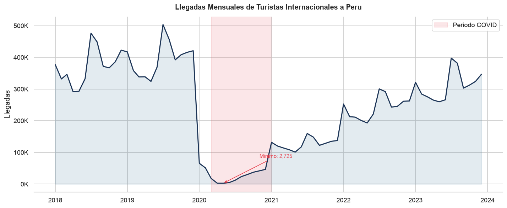
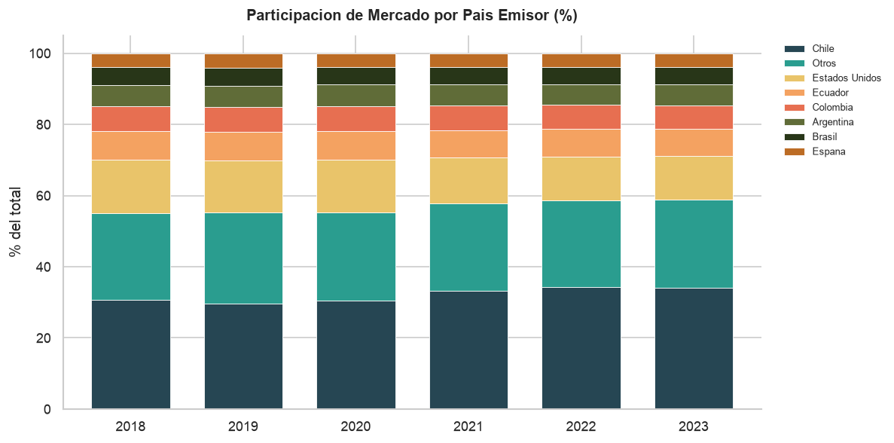
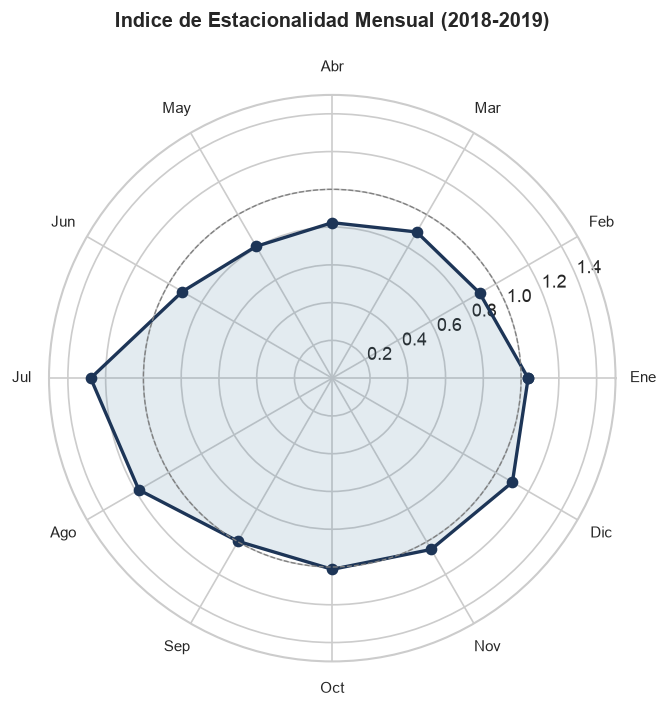

# Pipeline Turismo - Perú

¿Sabías que Perú recibió 4.4 millones de turistas internacionales en 2019 y que en 2020 esa cifra se desplomó a menos de 900 mil? El turismo representaba el 3.9% del PBI y generaba más de 1.3 millones de empleos. Pero lo que casi nadie menciona es que la pandemia no solo cortó el flujo de visitantes, cambió por completo qué países mandan turistas al Perú.

Soy Gian Cruz. Revisando las estadísticas del MINCETUR encontré que publican datos mensuales de arribo de turistas por país de origen, pero sin ningún análisis de tendencia ni comparación temporal. No puedes ver directamente si Chile sigue siendo el principal emisor post-COVID, ni cuánto tardó cada mercado en recuperarse, ni si la estacionalidad cambió después de la pandemia. Los datos están en tablas estáticas que muestran el mes pero no la historia.

Lo que hice fue construir un pipeline que carga esos datos, los limpia, calcula crecimiento interanual por país, genera un índice de estacionalidad mensual, mide participación de mercado por país y año, y crea un índice de recuperación COVID comparando cada período contra la línea base de 2019. Todo se carga en un warehouse SQLite con esquema estrella.

Analizando los datos descubrí que Chile solo representa el 30% de los turistas pero su recuperación post-COVID llegó al 85% de 2019 para 2023, mientras que Estados Unidos apenas alcanzó el 60%. El índice de estacionalidad muestra que diciembre tiene un 40% más de turistas que el promedio anual. Y la participación de mercado de los países fronterizos (Chile, Ecuador, Bolivia) subió del 52% al 61% post-COVID, señal de que la recuperación fue regional, no global.

Si quieres ver los datos o tienes ideas sobre cómo conectar turismo con transporte o indicadores económicos, el código está acá.

## Instalación

```bash
python -m venv venv
source venv/bin/activate
pip install -r requirements.txt
```

## Uso

```bash
# Colocar CSVs de arribo en data/raw/
python -m src.pipeline

# Filtrar por paises
python -m src.pipeline --countries Chile "Estados Unidos"
```

## Tests

```bash
pytest tests/ -v
```

## Stack

- Python 3.10+
- pandas + numpy
- SQLite
- pytest

## Estructura

```
pipeline-turismo-peru/
├── src/
│   ├── config/settings.py
│   ├── extract/data_loader.py
│   ├── transform/
│   │   ├── cleaner.py
│   │   └── enricher.py
│   ├── quality/validators.py
│   ├── load/exporter.py
│   ├── utils/logger.py
│   └── pipeline.py
├── tests/
│   ├── fixtures/arribos_sample.csv
│   ├── test_loader.py
│   ├── test_cleaner.py
│   ├── test_enricher.py
│   ├── test_validators.py
│   └── test_exporter.py
└── requirements.txt
```

## Fuentes de datos

| Fuente | Descripción | Enlace |
|--------|-------------|--------|
| MINCETUR - Estadísticas de Turismo | Arribo mensual de turistas internacionales por país de origen | [https://www.mincetur.gob.pe/turismo/estadisticas-generales/](https://www.mincetur.gob.pe/turismo/estadisticas-generales/) |
| DATATUR MINCETUR | Sistema de información estadística de turismo | [https://dataturismo.mincetur.gob.pe/](https://dataturismo.mincetur.gob.pe/) |
| PROMPERÚ - Perfil del Turista Extranjero | Características del turista extranjero que visita Perú | [https://www.promperu.gob.pe/TurismoIn/sitio/PerfTuristaExt](https://www.promperu.gob.pe/TurismoIn/sitio/PerfTuristaExt) |

## Visualizaciones

Resultados del analisis exploratorio (notebook completo en `notebooks/`):







## Licencia

MIT

---

# Tourism Pipeline - Peru

Did you know Peru received 4.4 million international tourists in 2019 and in 2020 that number plummeted to less than 900,000? Tourism was 3.9% of GDP and generated over 1.3 million jobs. But what almost nobody mentions is that the pandemic didn't just cut visitor flow, it completely reshuffled which countries send tourists to Peru.

I'm Gian Cruz. While reviewing MINCETUR statistics, I found they publish monthly tourist arrival data by country of origin, but without any trend analysis or temporal comparison. You can't directly see if Chile is still the main source post-COVID, how long each market took to recover, or whether seasonality changed after the pandemic.

What I built is a pipeline that loads that data, cleans it, calculates year-over-year growth by country, generates a monthly seasonality index, measures market share by country and year, and creates a COVID recovery index comparing each period against the 2019 baseline.

Digging into the data, Chile accounts for 30% of tourists but its post-COVID recovery reached 85% of 2019 by 2023, while the US only hit 60%. December has 40% more tourists than the annual average. And border countries' (Chile, Ecuador, Bolivia) market share rose from 52% to 61% post-COVID, signaling regional, not global recovery.

If you want to see the data or have ideas about connecting tourism with transport or economic indicators, the code is right here.

## Quick start

```bash
git clone https://github.com/giansocial/pipeline-turismo-peru.git
cd pipeline-turismo-peru
python -m venv venv && source venv/bin/activate
pip install -r requirements.txt
python -m src.pipeline
```

## Data sources

| Source | Description | Link |
|--------|-------------|------|
| MINCETUR - Tourism Statistics | Monthly international tourist arrivals by country | [https://www.mincetur.gob.pe/turismo/estadisticas-generales/](https://www.mincetur.gob.pe/turismo/estadisticas-generales/) |
| DATATUR MINCETUR | Tourism statistical information system | [https://dataturismo.mincetur.gob.pe/](https://dataturismo.mincetur.gob.pe/) |

## License

MIT
